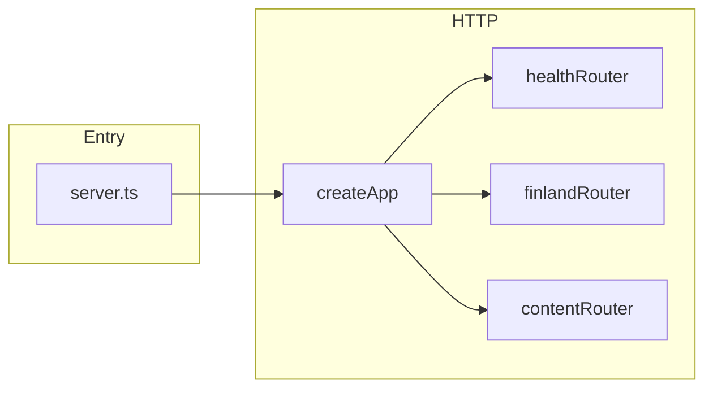
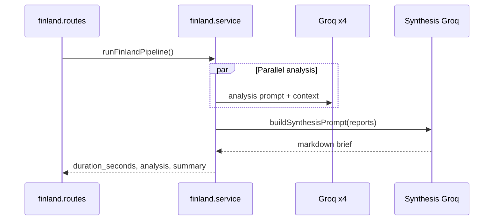

# Backend architecture

This document describes how the Node/TypeScript API is organized so new contributors can navigate the codebase, understand request flows, and extend features without stepping on other work.

---

## What this project is

A small **Express** HTTP server that exposes two independent product areas:

1. **Finland pipeline** — Runs the same analytical prompt against **four** Groq models in parallel, then **synthesizes** the four outputs with a fifth model into one “Finland trend intelligence” brief.
2. **Content feature** — Generates user-facing content from `user_preferences` and `hot_topics_summary` using a **single** Groq chat model; includes a simple Groq connectivity smoke test.

Both areas use **LangChain** (`@langchain/groq`, `@langchain/core`) to talk to **Groq-hosted** LLMs.

---

## Tech stack

| Piece | Role |
|--------|------|
| **TypeScript** | Source language; compiles to `dist/` |
| **Express 5** | HTTP routing and JSON body parsing |
| **dotenv** | Loads `.env` at process start |
| **cors** | Restricts browser origins (dev frontends) |
| **@langchain/groq** | `ChatGroq` client for Groq API |
| **zod** | Available for validation (not wired everywhere yet) |

**Scripts** (see `package.json`):

- `npm run dev` — `nodemon src/server.ts` (restart on change)
- `npm run build` — `tsc` → output under `dist/`
- `npm start` — `node dist/server.js` (run compiled app)

---

## High-level layout

```
src/
  server.ts                 # Process entry: load env, create app, listen
  config/
    groqConfig.ts           # Finland multi-model list, synthesis model, token/temp defaults
  http/
    createApp.ts            # Express app factory: CORS, JSON, mount routers
    health.routes.ts        # Liveness / config sanity
  features/
    finland/                 # “Finland pipeline” vertical slice
      finland.prompts.ts     # Prompt templates + AnalysisResults type + synthesis string builder
      finland.service.ts     # Parallel Groq calls + synthesis + runFinlandPipeline()
      finland.routes.ts      # GET/POST /api/finland-summary
    content/                 # “Content generation” vertical slice
      content.prompts.ts     # Content-generation PromptTemplate
      content.model.ts       # Single ChatGroq factory for this feature
      content.routes.ts      # POST /api/generateContent, GET /api/groq-test
  lib/
    logger.ts                # Console logger with consistent formatting
    groq/
      messageContent.ts      # LangChain message content → string (shared helper)
```

**Design intent:** Features live under `src/features/<name>/`. Shared, reusable utilities live under `src/lib/`. Cross-cutting HTTP wiring stays in `src/http/`. Global AI **defaults** for the Finland pipeline sit in `src/config/`.

---

## Request lifecycle



1. **`server.ts`** calls `dotenv.config({ path: ".env" })`, then `createApp()` from `http/createApp.ts`, then `listen(PORT)`.
2. **`createApp()`** applies CORS (allowed origins are hard-coded for local dev), `express.json()`, then mounts:
   - **Health** at `/` (e.g. `GET /health`)
   - **Finland** at `/api` (paths like `/api/finland-summary`)
   - **Content** at `/api` (paths like `/api/generateContent`, `/api/groq-test`)

There is no separate DI container: routes import services and models directly.

---

## HTTP surface (quick reference)

| Method | Path | Feature | Purpose |
|--------|------|---------|---------|
| `GET` | `/health` | Health | `{ status, groq_token_set }` — API key presence, not validity |
| `GET` / `POST` | `/api/finland-summary` | Finland | Runs full pipeline; same behavior for both verbs |
| `POST` | `/api/generateContent` | Content | JSON body: `user_preferences`, `hot_topics_summary` → `{ content }` |
| `GET` | `/api/groq-test` | Content | Sends a one-word probe to Groq; confirms key + model |

**CORS:** Non-browser clients often send no `Origin`; those requests are allowed. Browser requests must match `http://localhost:3000` or `http://localhost:5174` (edit `createApp.ts` to add production URLs).

---

## Feature: Finland pipeline

**Flow**



**Files**

- **`finland.prompts.ts`** — Defines `AnalysisResults` (keys `report1`…`report4`), the shared **analysis** `PromptTemplate`, and **`buildSynthesisPrompt()`** (plain string concatenation to avoid LangChain typing issues with dynamic sections).
- **`finland.service.ts`** — `runParallelAnalysis()` uses `MODELS` from `config/groqConfig.ts` and `Promise.allSettled` so one model failure does not kill the others (failed slots get a placeholder string). `runSynthesis()` uses `SYNTHESIS_MODEL`. `runFinlandPipeline()` orchestrates analysis + synthesis and logs duration.
- **`finland.routes.ts`** — Thin handlers; errors → `500` with `success: false`.

**Config dependency:** Model IDs, synthesis model, and `GROQ_CONFIG` (temperature / max tokens for the analysis pass) live in **`src/config/groqConfig.ts`**.

---

## Feature: Content generation

**Flow**

- **`content.model.ts`** — `createContentGroqModel()` builds one `ChatGroq` with `temperature: 0.3` and API key from `process.env.GROQ_API_KEY`. Model id defaults to `llama-3.1-8b-instant` unless `GROQ_MODEL` is set. `getContentModelId()` exposes the resolved id for responses and logging.
- **`content.prompts.ts`** — `PromptTemplate` for marketing-style copy from preferences + hot topics.
- **`content.routes.ts`** — Module-level singleton `model`; **`groqApiKey` and `groqModelId` are read once at import time** (same pattern as before refactor—change env requires process restart for these cached values).

**Validation:** `POST /api/generateContent` returns `400` if either body field is missing or blank; `500` if key missing or Groq throws.

---

## Shared library (`src/lib`)

| Module | Responsibility |
|--------|------------------|
| **`logger.ts`** | `info`, `success`, `warn`, `error`, `divider` — used heavily by Finland; content routes use minimal logging |
| **`groq/messageContent.ts`** | **`messageContentToString()`** — Normalizes LangChain `message.content` (string, parts array, etc.) to a single string. **Use this** whenever you read `result.content` from LangChain to avoid duplicated parsing logic |

---

## Configuration and environment

Create a **`.env`** in the project root (not committed with secrets). Typical variables:

| Variable | Used by | Notes |
|----------|---------|--------|
| `GROQ_API_KEY` | All Groq calls | Required for real requests |
| `GROQ_MODEL` | Content feature | Default content model id |
| `PORT` | `server.ts` | Defaults to **3001** |

Finland analysis models and synthesis model are **code-defined** in `config/groqConfig.ts`, not env-driven (change file to swap models).

---

## Adding a new feature (recommended pattern)

1. Create `src/features/<feature>/` with:
   - `<feature>.routes.ts` — export a `Router`, mount paths **relative to `/api`** if you follow existing convention (then register in `createApp.ts` with `app.use("/api", yourRouter)`).
   - Optional: `<feature>.service.ts`, `<feature>.prompts.ts`, `<feature>.model.ts` depending on complexity.
2. **Import the router** in `http/createApp.ts` and `app.use("/api", …)` (or another prefix if you prefer).
3. Keep **Finland** and **content** concerns in their folders unless code is truly shared — then move helpers to `src/lib/`.

This keeps Git conflicts low when multiple developers work on different features on the same branch.

---

## TypeScript and module resolution

- **`tsconfig.json`** — `module` / `moduleResolution`: **NodeNext**; **`rootDir`**: `src`, **`outDir`**: `dist`.
- Imports use **explicit `.js` extensions** only if you adopt that pattern project-wide; current code omits extensions (NodeNext allows this for local TS resolution in many setups). Run **`npm run build`** before release to ensure compile succeeds.

---

## Operational notes

- **Cold start / cost:** Finland pipeline runs **five** LLM calls per request (4 parallel + 1 synthesis). Expect latency and quota usage accordingly.
- **Errors:** Finland routes log message text; content routes return `details` in JSON on some failures.
- **Testing:** No automated test suite is configured yet; `GET /health` and `GET /api/groq-test` are manual smoke checks.

---

## File ownership (mental model)

| If you are changing… | Look first at… |
|----------------------|----------------|
| Finland prompts or model lineup | `features/finland/*.ts`, `config/groqConfig.ts` |
| Content generation behavior | `features/content/*.ts` |
| CORS, global middleware, route mounting | `http/createApp.ts` |
| Port or bootstrap | `server.ts` |
| Shared Groq string handling | `lib/groq/messageContent.ts` |

This should be enough to onboard a new developer, trace a request end-to-end, and know where to add the next feature safely.
